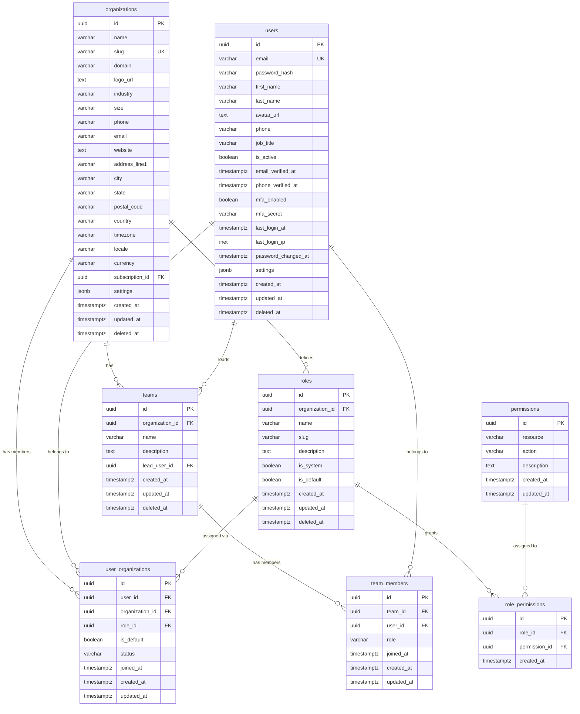
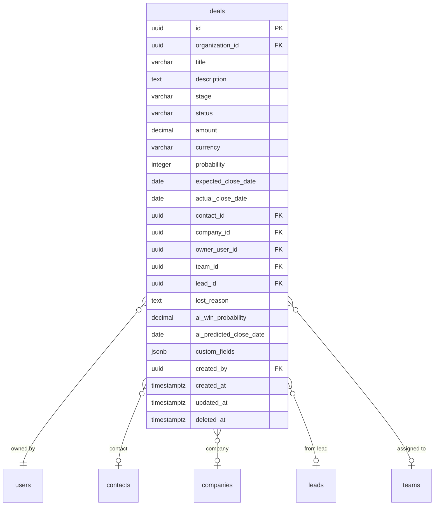
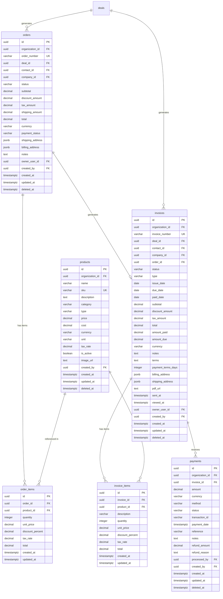
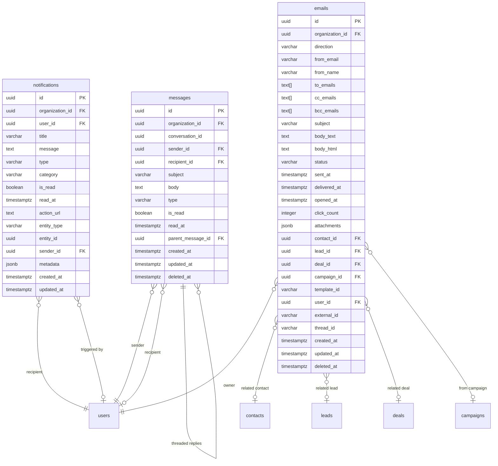
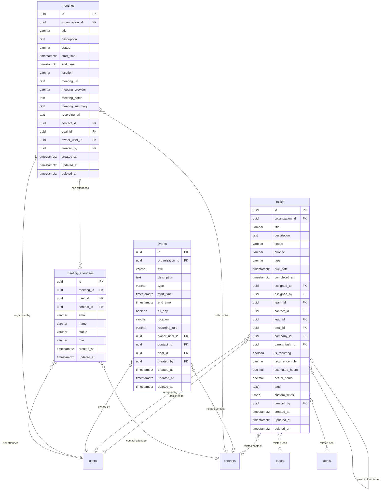
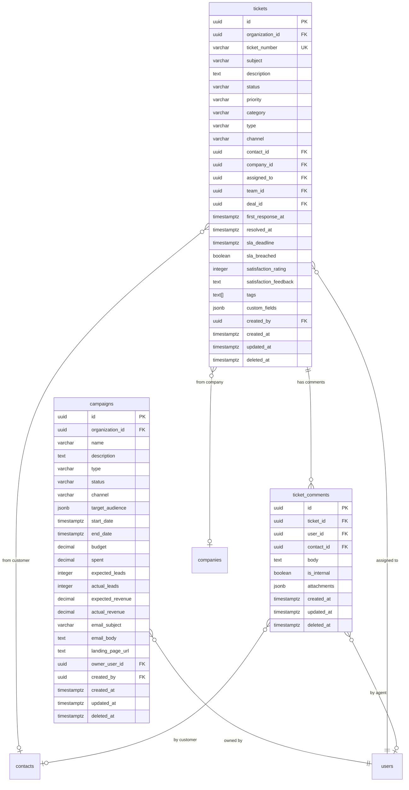
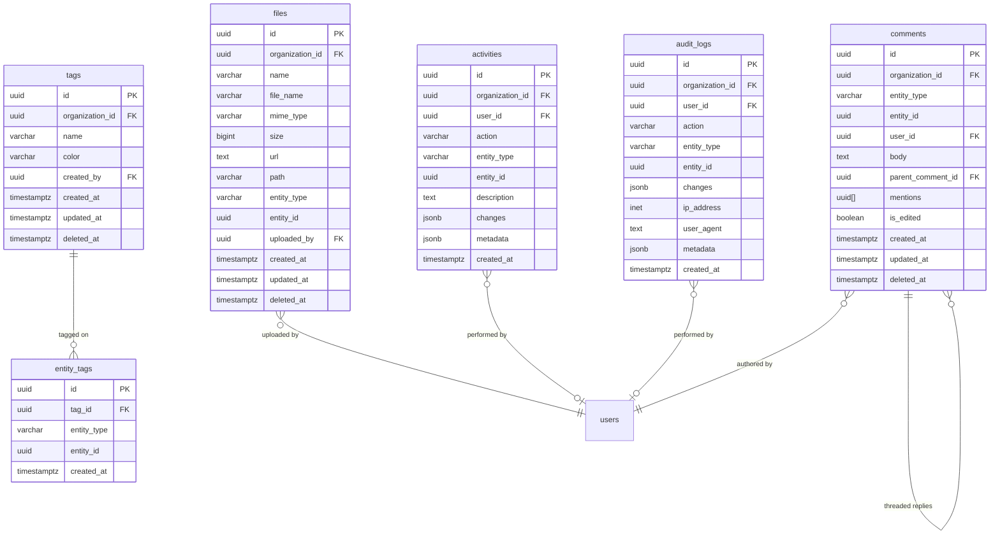
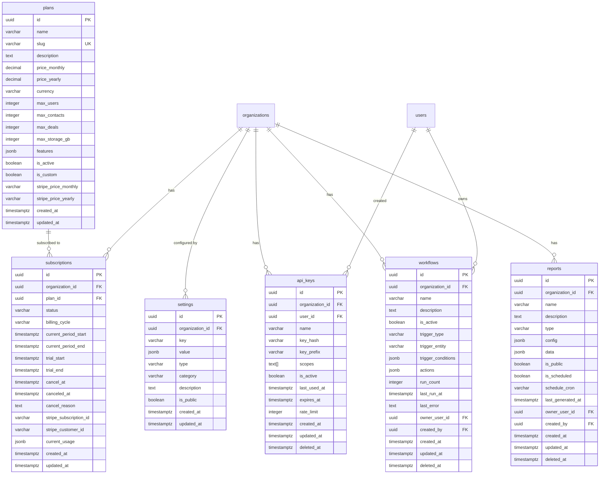
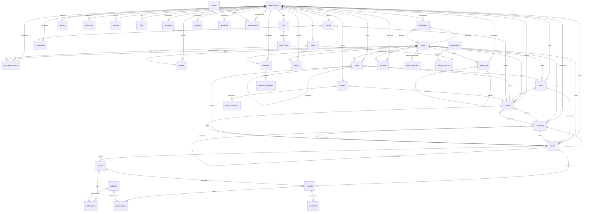

# Entity Relationship Diagram

## NovaCRM AI - Enterprise AI-Powered CRM Platform

Version: 1.0
Document Type: Entity Relationship Diagram
Status: Draft

---

## Table of Contents

1. [Diagram Overview](#1-diagram-overview)
2. [Core Module: Users & Organizations](#2-core-module-users--organizations)
3. [CRM Module: Leads, Contacts, Companies](#3-crm-module-leads-contacts-companies)
4. [Deals & Pipeline Module](#4-deals--pipeline-module)
5. [Commerce Module: Products, Orders, Invoices, Payments](#5-commerce-module-products-orders-invoices-payments)
6. [Communication Module: Messages, Emails, Notifications](#6-communication-module-messages-emails-notifications)
7. [Tasks & Calendar Module](#7-tasks--calendar-module)
8. [Marketing & Support Module](#8-marketing--support-module)
9. [System Module: Files, Comments, Tags, Activities, Audit Logs](#9-system-module-files-comments-tags-activities-audit-logs)
10. [Billing & Settings Module](#10-billing--settings-module)
11. [Full System ER Diagram](#11-full-system-er-diagram)
12. [Relationship Reference Table](#12-relationship-reference-table)

---

## 1. Diagram Overview

NovaCRM AI uses a **multi-tenant architecture** where every data table references an `organization_id` foreign key. The system consists of **40 tables** organized into the following modules:

| Module | Tables | Description |
|--------|--------|-------------|
| Core | 8 | Users, organizations, teams, roles, permissions |
| CRM | 4 | Leads, contacts, companies, deals |
| Commerce | 6 | Products, orders, invoices, payments |
| Communication | 3 | Messages, emails, notifications |
| Tasks & Calendar | 4 | Tasks, events, meetings, attendees |
| Marketing | 1 | Campaigns |
| Support | 2 | Tickets, comments |
| System | 8 | Files, tags, activities, audit logs, API keys, settings |
| Analytics | 1 | Reports |
| Automation | 1 | Workflows |
| Billing | 2 | Subscriptions, plans |
| **Total** | **40** | |

---

## 2. Core Module: Users & Organizations

### Relationship Explanations

| Relationship | Type | Description |
|-------------|------|-------------|
| `organizations` -> `user_organizations` | 1:N | An organization has many member records |
| `users` -> `user_organizations` | 1:N | A user can belong to multiple organizations |
| `roles` -> `user_organizations` | 1:N | A role is assigned to many user-org memberships |
| `organizations` -> `teams` | 1:N | An organization has many teams |
| `users` -> `teams` | 1:N | A user can lead many teams |
| `teams` -> `team_members` | 1:N | A team has many members |
| `users` -> `team_members` | 1:N | A user can be in many teams |
| `organizations` -> `roles` | 1:N | An organization defines custom roles |
| `roles` -> `role_permissions` | 1:N | A role has many permissions |
| `permissions` -> `role_permissions` | 1:N | A permission can be in many roles |

---

## 3. CRM Module: Leads, Contacts, Companies

```mermaid
erDiagram
    leads {
        uuid id PK
        uuid organization_id FK
        varchar first_name
        varchar last_name
        varchar email
        varchar phone
        varchar company_name
        varchar job_title
        varchar industry
        varchar source
        varchar status
        varchar stage
        integer score
        timestamptz score_updated_at
        uuid owner_user_id FK
        uuid team_id FK
        decimal budget
        decimal expected_revenue
        timestamptz conversion_date
        uuid converted_contact_id FK
        uuid converted_deal_id FK
        timestamptz assigned_at
        timestamptz last_contacted_at
        timestamptz next_follow_up_at
        jsonb custom_fields
        uuid created_by FK
        timestamptz created_at
        timestamptz updated_at
        timestamptz deleted_at
    }

    contacts {
        uuid id PK
        uuid organization_id FK
        varchar first_name
        varchar last_name
        varchar email
        varchar phone
        varchar mobile
        varchar job_title
        varchar department
        uuid company_id FK
        uuid owner_user_id FK
        uuid lead_id FK
        date birthday
        varchar gender
        varchar language
        varchar address_line1
        varchar city
        varchar state
        varchar postal_code
        varchar country
        text linkedin_url
        text twitter_url
        jsonb custom_fields
        text[] tags
        uuid created_by FK
        timestamptz created_at
        timestamptz updated_at
        timestamptz deleted_at
    }

    companies {
        uuid id PK
        uuid organization_id FK
        varchar name
        varchar domain
        varchar industry
        varchar sub_industry
        varchar size
        decimal revenue
        integer founded_year
        varchar phone
        varchar email
        text website
        text logo_url
        text description
        varchar ticker_symbol
        uuid parent_company_id FK
        uuid owner_user_id FK
        jsonb custom_fields
        uuid created_by FK
        timestamptz created_at
        timestamptz updated_at
        timestamptz deleted_at
    }

    %% Relationships
    leads ||--o| contacts : "converts to"
    leads ||--o| deals : "converts to"
    leads }o--|| users : "owned by"
    leads }o--o| teams : "assigned to"
    leads }o--|| users : "created by"

    contacts }o--|| companies : "works at"
    contacts }o--|| users : "owned by"
    contacts }o--o| leads : "converted from"

    companies ||--o{ contacts : "has employees"
    companies ||--o{ deals : "has deals"
    companies }o--o| companies : "parent of"
    companies }o--|| users : "owned by"
```

### Relationship Explanations

| Relationship | Type | Description |
|-------------|------|-------------|
| `leads` -> `contacts` | 1:0..1 | A lead can be converted into a contact |
| `leads` -> `deals` | 1:0..1 | A lead can be converted into a deal |
| `leads` -> `users` (owner) | N:1 | A lead is assigned to one sales rep |
| `leads` -> `teams` | N:0..1 | A lead can be assigned to a team |
| `contacts` -> `companies` | N:1 | A contact works at one company |
| `contacts` -> `leads` | N:0..1 | A contact may have originated from a lead |
| `companies` -> `contacts` | 1:N | A company has many contacts |
| `companies` -> `companies` | 1:0..1 | Self-referencing parent company hierarchy |

---

## 4. Deals & Pipeline Module

### Relationship Explanations

| Relationship | Type | Description |
|-------------|------|-------------|
| `deals` -> `users` (owner) | N:1 | Each deal has one owner |
| `deals` -> `contacts` | N:0..1 | A deal is associated with one contact |
| `deals` -> `companies` | N:0..1 | A deal belongs to one company |
| `deals` -> `leads` | N:0..1 | A deal may have originated from a lead |
| `deals` -> `teams` | N:0..1 | A deal can be assigned to a team |

---

## 5. Commerce Module: Products, Orders, Invoices, Payments

### Relationship Explanations

| Relationship | Type | Description |
|-------------|------|-------------|
| `deals` -> `orders` | 1:N | A deal can generate multiple orders |
| `orders` -> `order_items` | 1:N | An order has many line items |
| `products` -> `order_items` | 1:N | A product appears in many order items |
| `orders` -> `invoices` | 1:0..1 | An order generates one invoice |
| `deals` -> `invoices` | 1:N | A deal can have multiple invoices |
| `invoices` -> `invoice_items` | 1:N | An invoice has many line items |
| `invoices` -> `payments` | 1:N | An invoice receives multiple payments |

---

## 6. Communication Module: Messages, Emails, Notifications

### Relationship Explanations

| Relationship | Type | Description |
|-------------|------|-------------|
| `messages` -> `users` (sender) | N:1 | Each message has one sender |
| `messages` -> `users` (recipient) | N:0..1 | Direct messages have one recipient |
| `messages` -> `messages` (thread) | 1:N | Self-referencing for threaded replies |
| `emails` -> `contacts` | N:0..1 | An email is related to one contact |
| `emails` -> `campaigns` | N:0..1 | Marketing emails link to campaigns |
| `notifications` -> `users` (recipient) | N:1 | Each notification goes to one user |

---

## 7. Tasks & Calendar Module

### Relationship Explanations

| Relationship | Type | Description |
|-------------|------|-------------|
| `tasks` -> `tasks` | 1:0..N | Self-referencing for subtasks |
| `tasks` -> `users` (assigned_to) | N:1 | A task is assigned to one user |
| `meetings` -> `meeting_attendees` | 1:N | A meeting has many attendees |
| `meeting_attendees` -> `users` | N:0..1 | Internal attendees are linked to users |
| `meeting_attendees` -> `contacts` | N:0..1 | External attendees are linked to contacts |

---

## 8. Marketing & Support Module

---

## 9. System Module: Files, Comments, Tags, Activities, Audit Logs

---

## 10. Billing & Settings Module

---

## 11. Full System ER Diagram

The following diagram shows all major entities and their relationships across the entire system. Polymorphic relationships (files, comments, tags, activities) connect to multiple entity types.

---

## 12. Relationship Reference Table

### All Relationships with Cardinality

| Parent Entity | Child Entity | Cardinality | FK Column | Description |
|--------------|-------------|-------------|-----------|-------------|
| organizations | users (via user_organizations) | M:N | organization_id, user_id | Users belong to multiple orgs |
| organizations | teams | 1:N | organization_id | Org has many teams |
| organizations | roles | 1:N | organization_id | Org defines custom roles |
| organizations | leads | 1:N | organization_id | Org has many leads |
| organizations | contacts | 1:N | organization_id | Org has many contacts |
| organizations | companies | 1:N | organization_id | Org has many companies |
| organizations | deals | 1:N | organization_id | Org has many deals |
| organizations | products | 1:N | organization_id | Org has product catalog |
| organizations | orders | 1:N | organization_id | Org has many orders |
| organizations | invoices | 1:N | organization_id | Org has many invoices |
| organizations | payments | 1:N | organization_id | Org has many payments |
| organizations | campaigns | 1:N | organization_id | Org has many campaigns |
| organizations | tasks | 1:N | organization_id | Org has many tasks |
| organizations | events | 1:N | organization_id | Org has many events |
| organizations | meetings | 1:N | organization_id | Org has many meetings |
| organizations | messages | 1:N | organization_id | Org has many messages |
| organizations | emails | 1:N | organization_id | Org tracks many emails |
| organizations | notifications | 1:N | organization_id | Org has many notifications |
| organizations | tickets | 1:N | organization_id | Org has many tickets |
| organizations | reports | 1:N | organization_id | Org has many reports |
| organizations | audit_logs | 1:N | organization_id | Org has audit trail |
| organizations | api_keys | 1:N | organization_id | Org has API keys |
| organizations | settings | 1:N | organization_id | Org has many settings |
| organizations | files | 1:N | organization_id | Org has many files |
| organizations | comments | 1:N | organization_id | Org has many comments |
| organizations | tags | 1:N | organization_id | Org has many tags |
| organizations | activities | 1:N | organization_id | Org has activity log |
| organizations | workflows | 1:N | organization_id | Org has automations |
| organizations | subscriptions | 1:1 | organization_id | One active subscription |
| organizations | plans (via subscriptions) | M:N | subscription.plan_id | Subscriptions link to plans |
| roles | user_organizations | 1:N | role_id | Role assigned to users |
| permissions | role_permissions | 1:N | permission_id | Permission in many roles |
| roles | role_permissions | 1:N | role_id | Role grants permissions |
| teams | team_members | 1:N | team_id | Team has members |
| users | team_members | 1:N | user_id | User in many teams |
| users | leads | 1:N | owner_user_id | User owns many leads |
| users | contacts | 1:N | owner_user_id | User owns many contacts |
| users | companies | 1:N | owner_user_id | User owns many companies |
| users | deals | 1:N | owner_user_id | User owns many deals |
| users | tasks (assigned_to) | 1:N | assigned_to | User has many tasks |
| users | tasks (assigned_by) | 1:N | assigned_by | User assigns many tasks |
| users | events | 1:N | owner_user_id | User owns many events |
| users | meetings | 1:N | owner_user_id | User organizes meetings |
| users | messages (sender) | 1:N | sender_id | User sends many messages |
| users | messages (recipient) | 1:N | recipient_id | User receives messages |
| users | notifications | 1:N | user_id | User receives notifications |
| users | emails | 1:N | user_id | User owns emails |
| users | api_keys | 1:N | user_id | User creates API keys |
| users | audit_logs | 1:N | user_id | User generates audit logs |
| leads | contacts | 1:0..1 | converted_contact_id | Lead converts to contact |
| leads | deals | 1:0..1 | converted_deal_id | Lead converts to deal |
| contacts | companies | N:1 | company_id | Contact works at company |
| companies | companies | 1:0..1 | parent_company_id | Parent-subsidiary hierarchy |
| deals | contacts | N:0..1 | contact_id | Deal linked to contact |
| deals | companies | N:0..1 | company_id | Deal linked to company |
| deals | orders | 1:N | deal_id | Deal generates orders |
| deals | invoices | 1:N | deal_id | Deal generates invoices |
| products | order_items | 1:N | product_id | Product in order items |
| products | invoice_items | 1:N | product_id | Product in invoice items |
| orders | order_items | 1:N | order_id | Order has line items |
| orders | invoices | 1:0..1 | order_id | Order generates invoice |
| invoices | invoice_items | 1:N | invoice_id | Invoice has line items |
| invoices | payments | 1:N | invoice_id | Invoice has payments |
| tasks | tasks | 1:0..N | parent_task_id | Task has subtasks |
| tasks | contacts | N:0..1 | contact_id | Task related to contact |
| tasks | leads | N:0..1 | lead_id | Task related to lead |
| tasks | deals | N:0..1 | deal_id | Task related to deal |
| meetings | meeting_attendees | 1:N | meeting_id | Meeting has attendees |
| campaigns | emails | 1:N | campaign_id | Campaign sends emails |
| tickets | ticket_comments | 1:N | ticket_id | Ticket has comments |
| tickets | contacts | N:0..1 | contact_id | Ticket from customer |
| tickets | users | N:1 | assigned_to | Ticket assigned to agent |
| tags | entity_tags | 1:N | tag_id | Tag applied to entities |
| messages | messages | 1:N | parent_message_id | Threaded replies |
| comments | comments | 1:N | parent_comment_id | Threaded comments |

### Polymorphic Relationships

Several tables use polymorphic associations (entity_type + entity_id) to connect to any entity:

| Table | entity_type values | Description |
|-------|--------------------|-------------|
| `files` | leads, contacts, companies, deals, tasks, meetings, tickets, campaigns | Attachments on any entity |
| `comments` | leads, contacts, companies, deals, tasks, meetings, tickets, campaigns, orders, invoices | Comments on any entity |
| `entity_tags` | leads, contacts, companies, deals, tasks, campaigns, tickets | Tags on any entity |
| `activities` | leads, contacts, companies, deals, tasks, meetings, campaigns, tickets, orders, invoices | Activity timeline on any entity |
| `audit_logs` | users, leads, contacts, companies, deals, tasks, campaigns, tickets, settings, roles | Audit trail for any entity |
| `notifications` | leads, deals, tasks, meetings, tickets, comments, orders, invoices | Notifications for any entity |
| `emails` | (via contact_id, lead_id, deal_id, campaign_id) | Emails linked to specific entities |

### Cascade Rules

| Parent | Child | On Delete | On Update |
|--------|-------|-----------|-----------|
| organizations | (all child tables) | RESTRICT | CASCADE |
| users | user_organizations | CASCADE | CASCADE |
| users | team_members | CASCADE | CASCADE |
| roles | user_organizations | RESTRICT | CASCADE |
| roles | role_permissions | CASCADE | CASCADE |
| permissions | role_permissions | CASCADE | CASCADE |
| teams | team_members | CASCADE | CASCADE |
| orders | order_items | CASCADE | CASCADE |
| invoices | invoice_items | CASCADE | CASCADE |
| invoices | payments | RESTRICT | CASCADE |
| meetings | meeting_attendees | CASCADE | CASCADE |
| tickets | ticket_comments | CASCADE | CASCADE |
| tags | entity_tags | CASCADE | CASCADE |
| (any) | files | SET NULL | CASCADE |
| (any) | comments | SET NULL | CASCADE |
| (any) | activities | RESTRICT | CASCADE |
| (any) | audit_logs | RESTRICT | CASCADE |
